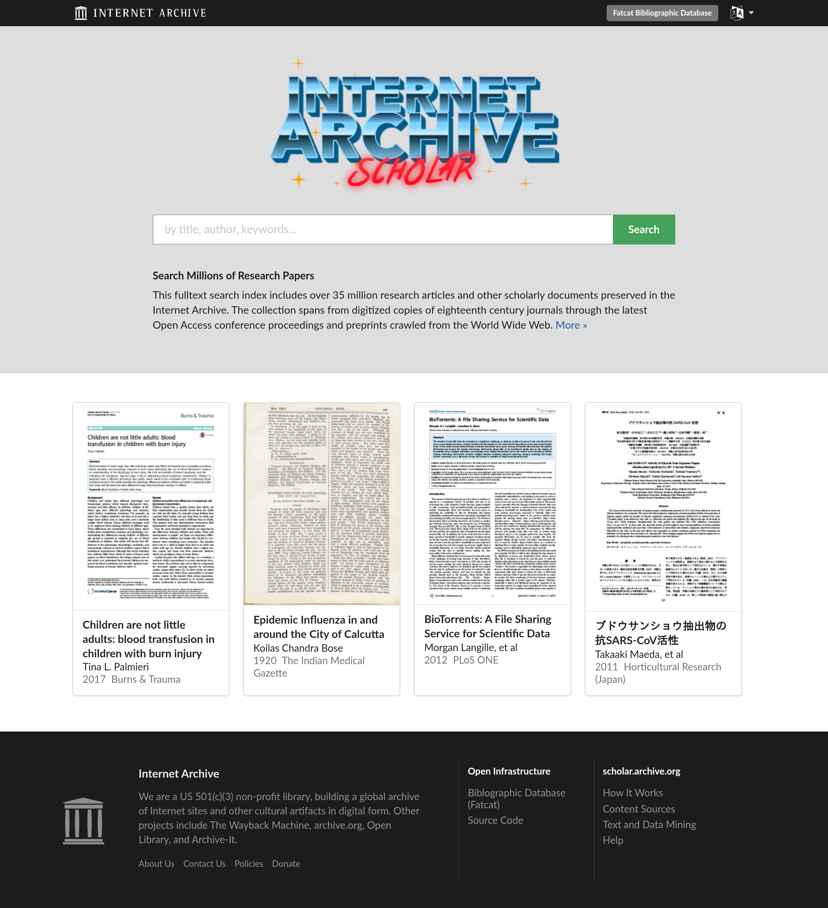

# webscreenie

Create a webpage screenshot from the command line.

```
$ webscreenie -o out.png http://scholar.archive.org
```



By default the full viewport is captured at a 2x scale factor through a
headless Chrome browser, producing a high-fidelity PNG. This is a small,
idiomatic Go port of [sindresorhus/capture-website-cli][cw], using
[chromedp][chromedp] to drive Chrome over the DevTools Protocol and
[cobra][cobra] for the CLI.

[cw]: https://github.com/sindresorhus/capture-website-cli
[chromedp]: https://github.com/chromedp/chromedp
[cobra]: https://github.com/spf13/cobra

## Requirements

A Chrome or Chromium binary on your `PATH` (chromedp discovers it
automatically). No separate driver is needed.

## Install

```sh
go install github.com/miku/webscreenie@latest
```

Or build from a checkout:

```sh
go build -o webscreenie .
```

## Usage

The input may be a URL, a local HTML file, or HTML piped in via stdin (`-`).
If `--output` is omitted, the image is written to
`webscreenie-<timestamp>.<ext>` in the current directory.

```sh
# A URL
webscreenie -o shot.png https://example.com

# A local file
webscreenie -o page.png index.html

# Inline HTML from stdin
echo '<h1>Unicorn</h1>' | webscreenie -o hello.png -

# Full page, dark mode
webscreenie --full-page --dark-mode -o full.png https://example.com

# Just one element, as JPEG
webscreenie --element '.main' -t jpeg --quality 80 -o main.jpg https://example.com

# Dismiss a cookie banner automatically, then capture
webscreenie --hide-cookie-banners -o shot.png https://example.com

# Or dismiss a specific banner manually
webscreenie --hide-element '#onetrust-banner-sdk' -o shot.png https://example.com
webscreenie --click-element 'button#accept-all' -o shot.png https://example.com
```

## Dismissing cookie banners

Two complementary approaches:

- **Manual** — `--hide-element <selector>` hides matching elements
  (`display:none`), and `--click-element <selector>` clicks the first match
  (e.g. an "Accept" button). Both are repeatable and applied after load and
  any `--delay`. Predictable, per-site, no network needed.
- **Automatic** — `--hide-cookie-banners` hides banners using a community
  filter list ([Fanboy's Cookie List][fb] by default). Only the cosmetic
  element-hiding rules are used; the banner is *hidden*, not consented to. The
  list is cached under your XDG cache directory
  (`$XDG_CACHE_HOME/webscreenie/`, i.e. `~/.cache/webscreenie/` on Linux) and
  downloaded on first use. Refresh it with `--update-filter-list`, or point at
  a different list with `--filter-list-url`. Running `--update-filter-list`
  with no input just refreshes the cache and exits.

[fb]: https://secure.fanboy.co.nz/fanboy-cookiemonster.txt


## Options

| Flag                  | Default | Description                                         |
| --------------------- | ------- | --------------------------------------------------- |
| `-o, --output`        | auto    | Output file path                                    |
| `--width`             | 1280    | Viewport width                                      |
| `--height`            | 800     | Viewport height                                     |
| `--scale-factor`      | 2       | Device scale factor (DPR); >1 for retina fidelity   |
| `-t, --type`          | png     | Image type: `png` or `jpeg`                         |
| `--quality`           | 100     | JPEG quality 0..100 (ignored for PNG)               |
| `--full-page`         | false   | Capture the full scrollable page                    |
| `--element`           |         | Capture only the element matching this CSS selector |
| `--wait-for-element`  |         | Wait for this selector to be visible before capture |
| `--timeout`           | 60s     | Page-load timeout (`0` disables)                    |
| `--delay`             | 0       | Pause after load before capturing                   |
| `--javascript`        | true    | Enable JavaScript execution (`--javascript=false`)  |
| `--dark-mode`         | false   | Emulate a dark color-scheme preference              |
| `--user-agent`        |         | Override the browser user agent                     |
| `-H, --header`        |         | Extra HTTP header `Name: value` (repeatable)        |
| `--insecure`          | false   | Accept invalid TLS certificates                     |
| `--debug`             | false   | Show the browser window                             |
| `--overwrite`         | false   | Overwrite the output file if it exists              |
| `--hide-element`      |         | Hide elements matching this selector (repeatable)   |
| `--click-element`     |         | Click element matching this selector (repeatable)   |
| `--hide-cookie-banners` | false | Hide cookie banners via a cached filter list        |
| `--aggressive`        | false   | Also remove banners with DOM heuristics             |
| `--filter-list-url`   | Fanboy  | Filter list source for `--hide-cookie-banners`      |
| `--update-filter-list`| false   | Re-download the filter list before use              |

## Project layout

```
main.go                         entry point
cmd/root.go                     cobra command, flag parsing, I/O
internal/capture/options.go     Options struct and defaults
internal/capture/capture.go     chromedp capture logic
internal/filterlist/...         cookie filter-list download, cache and parse
```

## Status

This is an early sketch covering the most-used options. The reference CLI has
several more (device emulation, PDF output, element clipping/insets,
script/style injection); these are intentionally left out for now and are
straightforward follow-ups against the `internal/capture` package.
